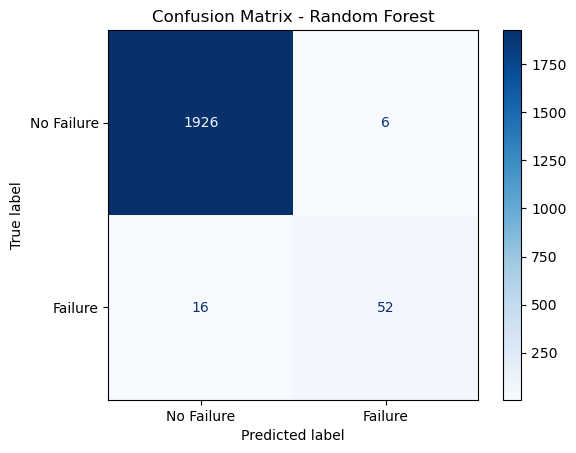
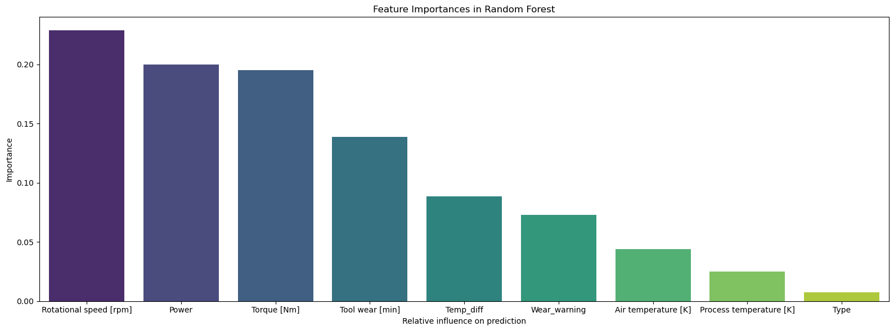

# Predictive Maintenance: Machine Failure Classification

##  Project Overview
An end-to-end Machine Learning project designed to predict industrial equipment failures before they occur using sensor telemetry data (rotational speed, torque, temperature, and tool wear). 

The primary business objective is to minimize costly equipment downtime by catching the maximum number of actual failures, even if it results in occasional false alarms for routine inspections.

##  The Data
The project utilizes the **AI4I 2020 Predictive Maintenance Dataset**.
* **Total Records:** 10,000 instances of machine operational cycles.
* **Class Imbalance:** Extreme target imbalance. 
  * Normal Operation: **96.6%**
  * Failure Events: **3.4%**

##  Engineering Approach
1. **Feature Engineering:** Extracted domain-specific physical properties to provide the model with stronger signals. For instance, calculating mechanical `Power` (Rotational Speed × Torque) and `Temp_diff` (Process Temp - Air Temp).
2. **Modeling:** Implemented a `RandomForestClassifier`. To combat the extreme class imbalance, the `class_weight='balanced'` parameter was applied to aggressively penalize False Negatives.
3. **Evaluation Metric:** Optimized for the **$F_2$-score**, which assigns twice the weight to Recall compared to Precision, aligning strictly with the business priority of not missing catastrophic failures.

##  Key Results
The model successfully identifies complex, non-linear failure patterns and drastically outperforms the baseline.

* **Precision (Class 1): 0.90** — 90% of the model's failure alerts are genuine issues, meaning engineers won't waste time on false alarms.
* **Recall (Class 1): 0.76** — The model successfully intercepts 76% of all actual machine breakdowns.
* **F2-Score:** Achieved **0.788** (compared to the Baseline dummy model's 0.0).

### Confusion Matrix
*Visualizing True Positives vs. False Negatives:*




### Feature Importances
Engineered features (`Power`, `Temp_diff`) outperformed raw sensor data, validating the feature engineering strategy. Interestingly, the intrinsic quality of the machine (`Type` L/M/H) had almost zero predictive value compared to its operational stress.




## 📁 Repository Structure
```text
├──assets/
|   ├── images/
├── data/
│   ├── raw/               # Original dataset 
│   └── processed/         # Cleaned and engineered datasets
├── notebooks/
│   ├── 01_eda_and_cleaning.ipynb
│   ├── 02_feature_engineering.ipynb
│   └── 03_modeling.ipynb
├── .gitignore
├── README.md